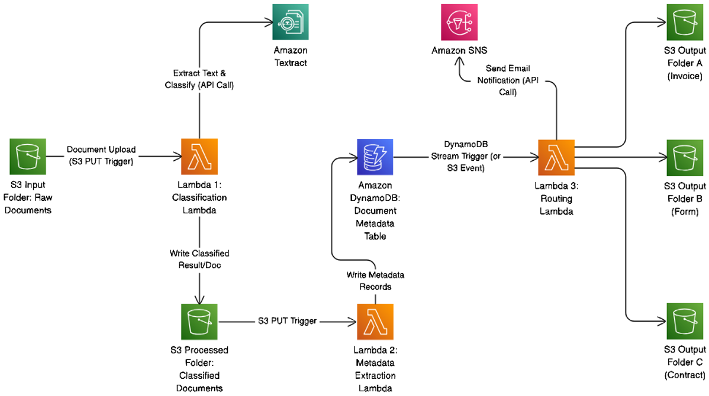

# Automated Document Processing & Routing System

**AWS Cloud Computing Final Project · ESADE Business School**  
Team: David Puchala · Giorgio Fiorentino · Jakob Kohrgruber · María Angélica Mora Zamora · Warren Yuqing Liu

---

## Overview

Companies in document-heavy industries receive hundreds of documents daily — contracts, invoices, forms — in mixed formats. Manual sorting is slow, error-prone, and a poor use of skilled staff time.

This project builds a fully serverless, ML-driven pipeline on AWS. A user uploads a document; the system classifies it, routes it to the correct S3 folder, logs metadata to DynamoDB, and sends an email notification via SNS — all automatically.

---

## Architecture



The pipeline runs across three Lambda functions:

1. **Lambda 1 – Classification:** triggered by an S3 PUT on the raw documents folder. Calls Textract to extract text, runs the ML model, and writes the classified document to the S3 processed folder.
2. **Lambda 2 – Metadata Extraction:** triggered by the S3 PUT on the processed folder. Writes document metadata and classification results to DynamoDB.
3. **Lambda 3 – Routing:** triggered by a DynamoDB Stream. Copies the document to the correct S3 output folder (Invoice / Form / Contract) and sends an email notification via SNS.

**AWS Services:** Lambda · S3 · Textract · DynamoDB (+ Streams) · SNS · API Gateway

---

## Machine Learning Model

We use a **TF-IDF + Logistic Regression** pipeline. This was chosen over SageMaker-hosted models because it delivers strong accuracy on keyword-rich document text, is lightweight enough to load directly inside Lambda, and requires no external ML services.

```python
Pipeline([
    ("tfidf", TfidfVectorizer(max_features=5000, ngram_range=(1, 2), stop_words="english")),
    ("clf", LogisticRegression(max_iter=1000))
])
```

**Training data:** 630+ documents (invoices, forms, contracts) sourced from open datasets in PDF, PNG, and JPG format. Text extracted using `pdfplumber` (PDFs) and `pytesseract` (images). The trained model is serialised with `joblib` and stored in S3, loaded at Lambda cold-start.

---

## Dashboard

`dashboard.html` is a single-file frontend that:
- Accepts document uploads and sends them to API Gateway as base64
- Polls the status API every 3 seconds until DynamoDB confirms classification
- Displays classification label, confidence score, S3 destination, and DynamoDB metadata per document

---

## Performance & Cost

| Metric | Value |
|--------|-------|
| End-to-end latency | ~7.6 seconds |
| Cost per inference | ~$0.000127 |
| 100k inferences/year | ~$12.70 |

Latency reflects the full async pipeline including cold starts and DynamoDB Streams — not model inference time alone. For a mid-sized law firm processing ~100k documents/year, annual inference cost is effectively negligible.

**Limitations:** limited training data, no drift monitoring, edge cases may route to manual review.

---

## Repository Structure

```
├── build_dataset.py        # Text extraction from PDFs/images → training_data.csv
├── train_model.py          # Model training, evaluation, export to .pkl
├── document_classifier.pkl # Serialised model
├── training_data.csv       # Labelled text dataset
├── training_data.xlsx      # Same dataset in Excel format
├── dashboard.html          # Frontend dashboard
└── architecture.png        # AWS architecture diagram
```

---

## Local Setup

**1. Build the dataset**
```bash
pip install pdfplumber pytesseract pillow pandas
python build_dataset.py
```

**2. Train the model**
```bash
pip install scikit-learn pandas joblib openpyxl
python train_model.py
```
Outputs `document_classifier.pkl`. Upload this to S3 and reference its path in the classification Lambda.
